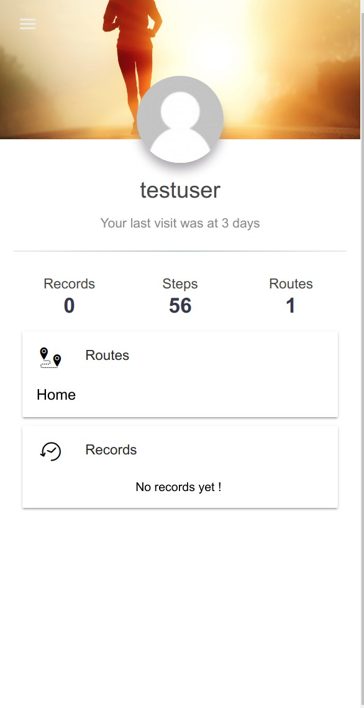
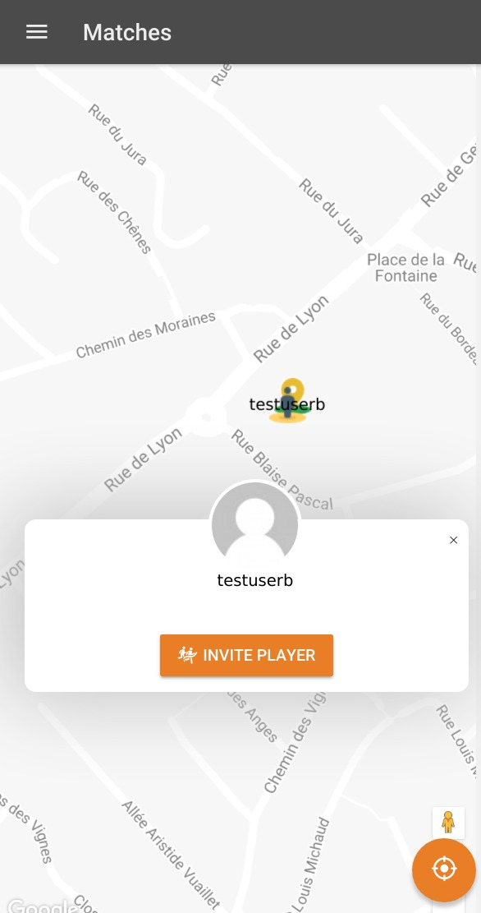
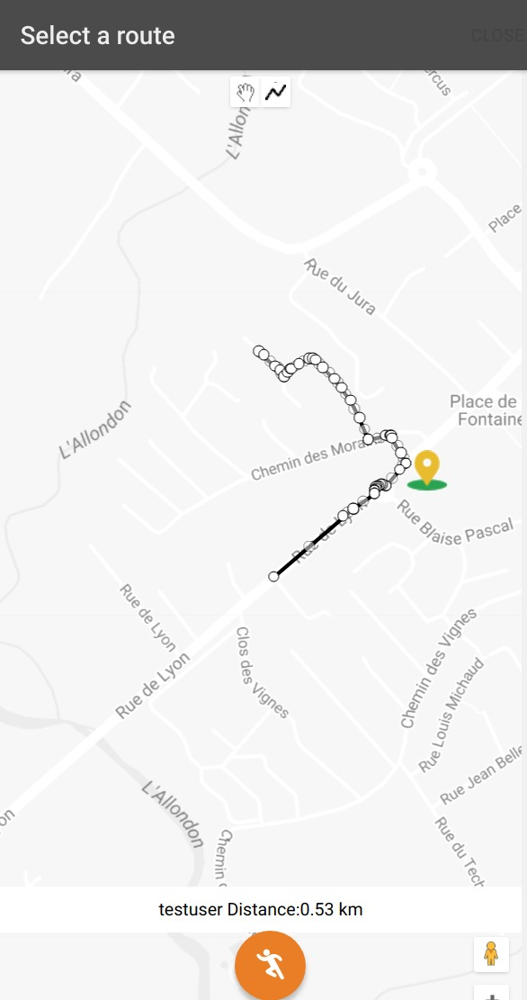
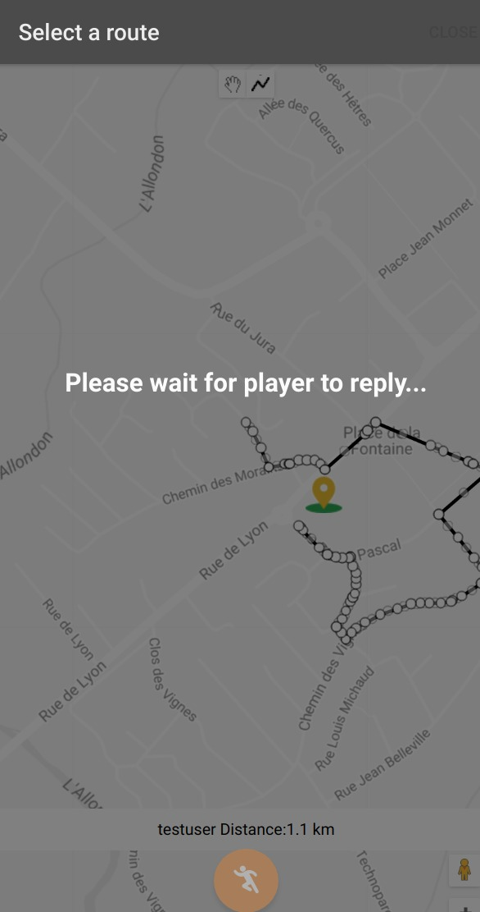
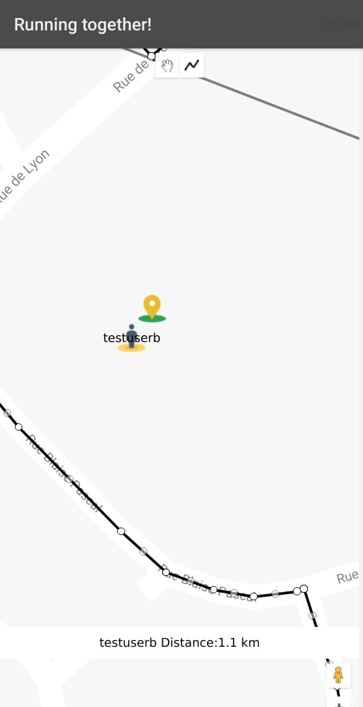

# Vento Mobile Client

A hybrid mobile client for [Vento RestAPI](https://github.com/Vento/rest-api), using [Ionic framework 2](https://ionicframework.com/) and STOMP over Websockets

## Screenshots:

### Login

### Dashboard

### Player invitation

### Route selection

### Player response wait

### Player joined

